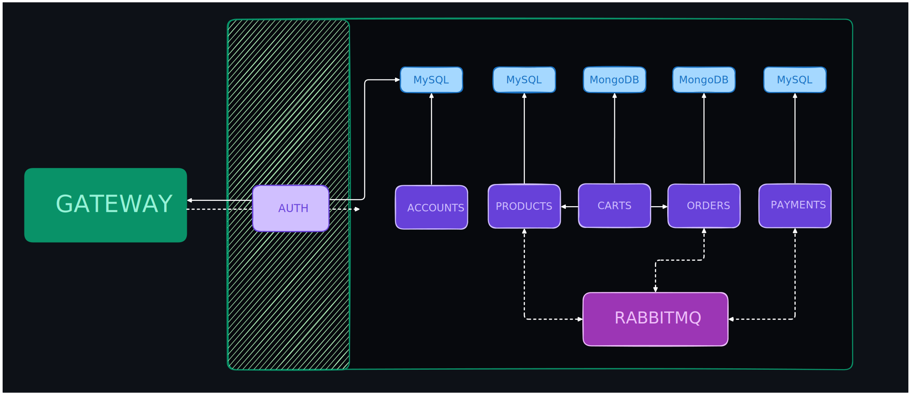

# Microsservices Store

## 🔎 About the project

E-CommerceApp is a REST API for an e-commerce store aimed at the PC-Gaming market, based on microservices architecture, it has both operations carried out for the customer and operations carried out by employees and administrators.

## 🔧 Adjustments and improvements

The project is still under development, is currently using development settings. The next updates will focus on the following tasks:

- [x] Add standard price and promotional price
- [x] Implement a better separation of Users and Clients
- [x] Add more details to poor entities
- [x] Add more behaviors to entities, reducing dependence on external services for basic domain rules
- [x] Add a promotional price scheduler, so that when you set a promotional price, you also set a deadline for the promotional
- [x] Implement Spring Security
- [x] Create a Cart service
- [ ] Create evaluation service
- [ ] Create discount coupon system
- [ ] Currently microservices identify the user from the headers. In the future we will remove this and replace it with each microservice having the ability to decode the JWT, retrieving the claims from the body and forming a UserDetailsImpl
- [ ] Improvements in authentication, such as sending tokens by Email and authentication via third parties
- [ ] Sending emails regarding orders
- [ ] Create fallbacks for failures between services
- [ ] Create and handle dead letter exchanges
- [ ] Configure messaging rules
- [ ] Configure load balancing rules
- [ ] Create docker-compose to generate messaging service instances and databases
- [ ] Create detailed documentation with Postman (currently there are only requests in the Postman collection)

## 📋 Prerequisites

Before you begin, make sure you've met the following requirements:

- Java 17
- Server RabbitMQ 3.7
- Database MySQL 8.0

## 🖥️ Functionalities

- ✅ Authentication on `account-ms`
- ✅ Authorization on `auth-ms`

- ✅ Scheduling promotions

- ✅ CRUD of customers and system administrators in the `account-ms` microservice
- ✅ Products CRUD
- ✅ Order CRUD and direct and indirect communication with the Products and Payments microservices
- ✅ Payment persistence based on messaging

- ✅ Highly parameterized search

- ✅ Updates from related entities in different services through messaging

## 🛠️ Tecnologies

- [TestContainers](https://testcontainers.com/)
- [RabbitMQ](https://www.rabbitmq.com/)
- [JWT](https://github.com/auth0/java-jwt)
- [MySQL](https://dev.mysql.com/downloads/connector/j/)
- [Spring Cloud Netflix](https://cloud.spring.io/spring-cloud-netflix/reference/html/)
- [Spring Cloud Gateway](https://spring.io/projects/spring-cloud-gateway)
- [Spring Cloud OpenFeign](https://spring.io/projects/spring-cloud-openfeign)
- [Spring Security Crypto](https://docs.spring.io/spring-security/reference/features/integrations/cryptography.html)
- [SpringBoot Starter JPA](https://spring.io/projects/spring-data-jpa)
- [SpringBoot Starter Web]()
- [SpringBoot Starter Validation](https://docs.spring.io/spring-framework/reference/core/validation/beanvalidation.html)

## ⚙️ System overview

## 📦 Endpoints 

- **To log in as an ADMIN use username `root` and password `root@123` or create the environment variables `ADMIN_USERNAME` and `ADMIN_PASSWORD`.**

# 🤝 Credits

- Special thanks to [@AlexandreMadeira](https://github.com/MadeiraAlexandre) for helping me with several suggestions, such as creating the concept of system services, and with the relationships of some entities.